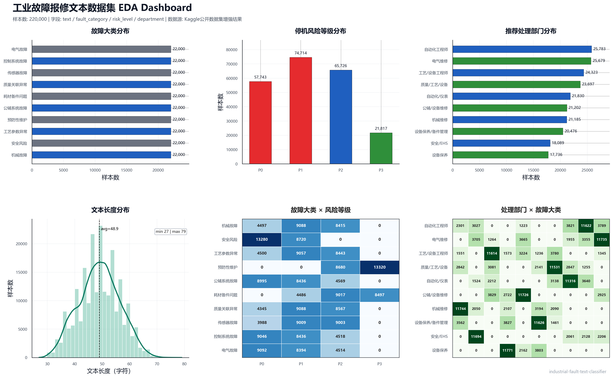

<div align="center">

# Industrial Fault Text Classifier | 化工业设备报修文本多任务分类系统

面向化工业报修文本的故障大类、停机风险等级与处理部门多任务分类方案


简体中文 | [English](README_EN.md)

</div>

```text
repair text -> label mapping -> data quality check -> stratified split -> multi-task classifier -> evaluation -> inference demo
```

> 本仓库公开数据基于 Kaggle 公开企业数据集进行清洗与增强构建，仅用于复现项目流程、验证建模方案与展示工程实现；数据中不包含企业真实生产工单、设备编号、人员信息或现场敏感信息。如项目在实际企业场景中落地，真实报修记录及中间数据产物应按企业数据安全要求处理，不在公开仓库中发布。

## 0x01. 项目背景

化工生产现场的报修记录、点检记录和维修工单通常以文本形式记录。一条工单文本中可能同时包含设备对象、部件位置、故障现象、异常程度、停机影响和建议处理方向，例如“压缩机轴承温度持续升高，伴随振动增大，需尽快安排机修检查”。传统处理方式主要依赖调度人员逐条阅读文本后进行人工识别与分派，容易受到文本表述不规范、人员经验差异、值守时段压力以及高风险工单集中出现等因素影响，进而造成故障类别判断不一致、响应优先级滞后或处理部门分派不准确。

本项目将单条报修文本转换为三个结构化判断结果：

| 任务 | 输出 | 用途 |
|------|------|------|
| 故障大类分类 | 机械故障、电气故障、传感器故障等 | 形成维修统计与故障画像 |
| 停机风险等级识别 | P0 / P1 / P2 / P3 | 辅助识别高优先级工单 |
| 处理部门推荐 | 机械维修、电气维修、自动化工程师等 | 降低转派和等待成本 |

项目定位不是替代工程师判断，而是将非结构化报修文本转化为可检索、可统计、可辅助派单的结构化信息。

---

## 0x02. 数据集与标签体系

当前公开仓库提交基于 Kaggle 公开企业数据集清洗增强后的全量 CSV，并保留小规模样例用于快速 smoke test：

```text
data/full/chemical_repair_text_dataset_cn.csv
data/samples/sample_repair_text.csv
```

全量 CSV 约 22 万行，采用带表头的标准 CSV 格式。`data/raw/` 仅用于存放本地原始 TXT/TSV 来源文件，该目录已加入 `.gitignore`。标准化后的数据字段如下：

| 字段 | 含义 |
|------|------|
| `text` | 设备报修文本 |
| `fault_category` | 故障大类 |
| `risk_level` | 停机风险等级 |
| `department` | 推荐处理部门 |

标签体系保存在 [configs/labels.json](configs/labels.json)，包括 10 个故障大类、4 个风险等级和 10 个处理部门。训练切分时使用三任务组合标签进行分层，尽量保持 `train / val / test` 中的联合分布一致。

### 2.1 EDA

为了确认多任务标签分布、文本长度分布以及标签之间的组合关系，项目将 Step 2 的主要 EDA 结果整理为一张组合图。图中包含故障大类分布、停机风险等级分布、推荐处理部门分布、文本长度分布，以及 `fault_category × risk_level`、`department × fault_category` 两组交叉热力图。



### 2.2 数据质量控制与清洗

在模型训练前，项目将报修文本、标签字段和数据切分结果纳入统一的数据质量控制流程。Step 3 不仅执行基础清洗操作，也对监督信号一致性、潜在标签泄漏和三任务联合分布进行审计，以降低噪声样本对分类边界和评估结论的影响。

| 质量项 | 风险说明 | 控制策略 |
|------|------|------|
| 关键字段缺失 | `text`、`fault_category`、`risk_level` 或 `department` 任一字段缺失时，样本无法形成完整的多任务监督信号 | 剔除关键字段为空的记录，并保留清洗前后的样本计数 |
| 完全重复记录 | 文本与三组标签完全一致的重复样本会放大局部模式权重，影响训练集分布 | 保留首条有效记录，删除重复副本，避免重复样本影响模型拟合 |
| 同文本标签冲突 | 相同报修文本对应多组不同标签，说明标注口径存在歧义或监督信号不一致 | 剔除冲突文本对应的全部样本，保证训练标签的可学习性与评估口径稳定 |
| 文本格式噪声 | 换行、制表符和连续空格会增加分词及字符 n-gram 特征的稀疏性 | 统一折叠空白字符并去除首尾空白，在不改变语义的前提下规范输入文本 |
| 潜在标签泄漏 | 文本中直接出现 `P0/P1`、处理部门名称等显式标签标识，可能导致模型学习非业务语义捷径 | 在 EDA 阶段统计疑似泄漏短语，作为数据源质量和后续脱敏规则的审计依据 |
| 切分分布偏移 | 仅按单一任务标签切分可能破坏 `fault_category`、`risk_level` 和 `department` 的联合分布，使验证指标失真 | 使用三任务组合标签进行分层切分，并保留各子集标签分布对比结果 |

---

## 0x03. 模型与技术选择调整过程

### 3.1 第一阶段：规则分派方案的适用边界

项目早期曾考虑采用关键词词典、故障短语库和部门映射规则，对报修文本进行故障分类、风险判断与处理部门推荐。例如，当文本中出现“轴承”“振动”“温升”等词汇时，将其归入机械故障；当文本中出现“联锁”“DCS”“阀位反馈”等表达时，将其归入控制系统或仪表相关类别。

该方案具备实现简单、可解释性强和上线成本低等优点，适合作为初始数据审计工具。但在化工生产现场的真实文本环境中，规则方案存在明显边界：

1. 现场记录中存在大量缩写、口语化描述、同义表达和不完整描述，规则覆盖成本会随数据规模持续上升。
2. P0/P1 等高风险等级往往依赖设备对象、故障现象、影响范围和持续时间的组合判断，而不是单个关键词触发。
3. 故障大类与处理部门并非严格一一对应，同类故障可能因设备位置、风险等级和生产影响不同而分派给不同团队。
4. 规则系统虽然便于解释和审计，但泛化能力有限，难以支撑长期迭代和跨场景迁移。

因此，本项目将规则方法定位为数据审计、标签泄漏检查和人工复核辅助工具，而不是主模型路线。

### 3.2 第二阶段：模型路线对比

在确定最终方案前，项目对四类技术路线进行了对比：

| 路线 | 代表方法 | 优势 | 局限 | 本项目定位 |
|------|----------|------|------|------------|
| 关键词规则 | 词典匹配、正则规则、人工映射表 | 可解释性强，部署成本低，便于审计 | 维护成本高，难以覆盖同义表达、隐含风险和复杂上下文 | 用于数据审计与泄漏检查，不作为主模型 |
| 传统机器学习 | TF-IDF / 字符 n-gram + Naive Bayes / Linear SVM | 训练速度快，依赖少，适合快速验证工程闭环 | 对长距离语义、上下文组合和复杂表达的建模能力有限 | 作为公开仓库默认 baseline |
| 预训练语言模型 | Chinese BERT / MacBERT / RoBERTa-wwm-ext | 能建模上下文语义，适合处理复杂报修表达 | 训练成本更高，需要 GPU、模型缓存和更严格的调参流程 | 作为正式语义建模路线 |
| 大语言模型分类 | Prompt 分类、少样本分类、外部推理接口 | 冷启动快，可生成解释性输出 | 成本、稳定性、数据安全、批量推理可控性仍需单独评估 | 适合作为后续质检、抽检或辅助复核方案 |

最终项目采用“轻量 baseline + BERT 多任务模型入口”的双路线设计。baseline 用于快速验证数据、脚本、评估与推理闭环；BERT 路线用于在具备算力和授权数据条件时进行正式语义建模。

### 3.3 第三阶段：从单任务分类到多任务联合建模

初始可行方案是分别训练三套分类器：一套预测故障大类，一套预测停机风险等级，一套预测处理部门。该方案实现简单，但会割裂三个任务之间的业务关联。

本项目最终将单条报修文本同时映射为三个结构化标签：

```text
报修文本
    |
共享文本特征 / 共享语义表示
    |
fault_category / risk_level / department
```

采用多任务设计的原因包括：

1. 故障大类与处理部门存在显著业务关联，例如机械故障通常更可能进入机械维修队列，控制系统故障更可能进入自动化或仪表相关队列。
2. 停机风险等级会影响派单优先级，也会影响后续复核策略和处理时限。
3. 三任务联合输出更接近真实派单流程，比单独预测某一个标签更具业务可用性。
4. BERT 方案可以通过共享编码器复用文本语义，再由三个分类头分别学习任务边界。

当前公开 baseline 采用同一字符 n-gram 特征逻辑，并为三个任务分别训练轻量分类器；BERT 入口采用共享中文 BERT 编码器和三个分类头，执行 encoder 与分类头的联合微调。

### 3.4 第四阶段：数据切分策略调整

如果仅按照单一标签进行分层切分，例如只按 `fault_category` 分层，可能导致 `risk_level` 和 `department` 在训练集、验证集、测试集中的联合分布发生偏移。对于多任务派单系统，这会降低验证指标对真实使用场景的代表性。

因此，项目在 Step 3 中使用三任务组合标签进行分层切分：

```python
stratify_key = fault_category + risk_level + department
```

该策略的目标不是追求每个单任务标签的表面均衡，而是尽量保持真实派单组合在 `train / val / test` 中的分布一致，使评估结果更接近端到端使用场景。

### 3.5 第五阶段：评估口径从准确率转向风险优先

初始评估方案容易只关注整体 accuracy。但在化工报修场景中，不同错误的业务代价并不相同：P0/P1 高风险工单被漏判，比普通 P2/P3 工单误分更值得关注；处理部门误分会带来转派和等待成本；三项任务中任一任务出错，都可能影响最终派单决策。

因此，项目将评估口径扩展为：

1. `accuracy`：观察每个任务的整体分类能力。
2. `macro-F1`：避免高频类别掩盖低频类别效果。
3. `P0/P1 recall`：重点衡量高风险工单是否被及时识别。
4. `three-task exact match`：衡量三项预测是否同时正确。
5. 混淆组合统计：定位故障类别、风险等级和处理部门之间的典型误分边界。

本项目不以单一最高准确率作为唯一目标，而是围绕派单风险、高风险召回、复核成本和部门转派成本建立评估体系。

### 3.6 第六阶段：从离线分类到生产辅助决策

离线模型只能完成“文本到标签”的基础转换。面向企业落地时，更合理的方式是将模型输出作为派单建议与风险提示，而不是直接替代工程师判断。

推荐的生产使用流程如下：

```text
新报修文本
    |
模型输出三任务标签
    |
置信度与风险等级判断
    |
高风险或低置信度样本进入复核队列
    |
复核结果回流训练数据
```

该设计保留了安全生产场景中必要的人工审核权，同时让模型承担高频、重复、标准化的初筛任务。后续如果接入真实企业工单，应优先完善低置信度样本回流、P0/P1 误分审计、部门误派分析和周期性再训练机制。

---

## 0x04. 技术架构与核心流程

```text
原始报修文本数据 (4列: text / fault_category / risk_level / department)
    |
    v
Step 1: 数据标准化与CSV固化
    ├── 读取原始TXT/TSV四列数据，统一字段名与编码
    ├── 校验字段数量、空字段、异常行和CSV转义
    ├── 输出全量CSV: data/full/chemical_repair_text_dataset_cn.csv (220,000行)
    └── 输出样例CSV: data/samples/sample_repair_text.csv (200行, 用于smoke test)
    |
    v
Step 2: 数据探索分析与质量审计
    ├── 统计三任务标签分布: 故障大类(10类) / 风险等级(4类) / 处理部门(10类)
    ├── 统计文本长度分布: min / max / mean / p50 / p90 / p95
    ├── 统计组合标签分布: fault_category + risk_level + department
    ├── 检查重复文本、同文本多标签冲突和疑似标签泄漏短语
    └── 输出报告: artifacts/reports/eda_report.json
    |
    v
Step 3: 数据清洗与分层切分
    ├── 删除空字段样本、完全重复行和同文本多标签冲突样本
    ├── 清洗结果: 220,000行 -> 219,160行
    ├── 生成标签映射: data/processed/labels.json
    ├── 按组合标签进行分层切分，保持三任务联合分布稳定
    └── 输出切分: train(175,272) / val(21,852) / test(22,036)
    |
    v
Step 4: 多任务文本分类模型训练
    ├── baseline: 字符n-gram特征 + 多任务Naive Bayes
    ├── BERT: shared encoder + fault/risk/department三个分类头
    ├── 微调策略: BERT encoder与分类头共同训练(全量微调)
    ├── 训练配置: max_length / batch_size / learning_rate / loss_weights
    └── 输出模型: artifacts/models/{backend}/model.pkl 或 model.pt
    |
    v
Step 5: 多任务评估与命令行推理
    ├── 评估指标: accuracy / macro-F1 / three-task exact match
    ├── 风险指标: P0/P1高风险召回
    ├── 错误分析: expected-predicted混淆组合统计
    ├── 输出报告: artifacts/reports/eval_report.json + predictions.csv
    └── 单条推理: 输入报修文本 -> 输出故障大类 / 风险等级 / 处理部门
```

---

## 0x05. 最终价值与落地场景

### 5.1 预测性能

本项目将单条报修文本同时映射为故障大类、停机风险等级和处理部门三个结构化结果。以下指标来自当前多任务 BERT 训练结果，用于描述模型在离线验证阶段的分类效果。

| 预测对象 | 评估指标 | 结果 | 价值解读 |
|------|------|------:|------|
| 故障大类 | accuracy / macro-F1 | 92.40% / 92.42% | 能较稳定地区分机械、电气、仪表、工艺、安全等主要故障类型 |
| 停机风险等级 | accuracy / macro-F1 | 85.84% / 86.09% | 可用于识别 P0/P1 高风险工单，并为优先级排序提供模型依据 |
| 处理部门 | accuracy / macro-F1 | 90.23% / 90.19% | 可为维修、自动化、工艺、安全等部门分派提供候选建议 |
| 三任务综合 | 平均 macro-F1 | 89.57% | 整体上能够支撑“故障识别 + 风险判断 + 部门推荐”的联合预测流程 |

### 5.2 业务价值

1. 将自然语言报修记录转换为结构化标签，减少工单初筛对人工经验和文本表达差异的依赖。
2. 对高风险工单进行前置识别，使调度人员能够优先关注可能影响安全、停机或产线连续性的事件。
3. 在工单创建阶段给出处理部门建议，降低反复转派、沟通确认和响应延迟带来的运维成本。
4. 将历史报修文本沉淀为可统计的数据资产，支持故障类型分析、部门负载分析和设备薄弱环节识别。
5. 对低置信度样本和高风险误分样本进行人工复核，并将修正结果回流训练集，持续提升模型对企业现场表达习惯的适应能力。

---

## 0x06. 运行方式

安装本地包：

```powershell
cd E:\Github\industrial-fault-text-classifier
python -m pip install -e .
```

快速跑通公开样例闭环：

```powershell
industrial-fault-go
```

按步骤运行：

```powershell
python scripts\step2_dataset_eda.py --input data\full\chemical_repair_text_dataset_cn.csv --report artifacts\reports\eda_report.json
python scripts\step3_clean_and_split.py --input data\full\chemical_repair_text_dataset_cn.csv --output-dir data\processed\splits --labels data\processed\labels.json --report artifacts\reports\split_report.json
python scripts\step4_model_training.py --train data\processed\splits\train.csv --val data\processed\splits\val.csv --labels data\processed\labels.json --model-dir artifacts\models\baseline --backend naive_bayes --max-train-samples 2000
python scripts\step5_evaluate_and_predict.py evaluate --model-dir artifacts\models\baseline --data data\processed\splits\test.csv --report artifacts\reports\eval_report.json --predictions artifacts\reports\predictions.csv
python scripts\step5_evaluate_and_predict.py predict --model-dir artifacts\models\baseline --text "空压机运行中压力波动明显，主线节拍受到影响，请安排检修。"
```

如需从本地原始 TXT/TSV 重新生成全量 CSV，可运行：

```powershell
python scripts\step1_convert_to_csv.py --input data\raw\chemical_repair_text_dataset_cn.txt --output data\full\chemical_repair_text_dataset_cn.csv
```

当前公开的 `industrial-fault-go`、Step 5 评估和单条预测闭环使用 `naive_bayes` 后端，便于在无 GPU 和无本地预训练模型缓存的环境中快速验证流程。BERT 后端已保留 Step 4 训练入口；统一评估与推理接口需在模型产物格式稳定后继续接入。

---

## 0x07. 项目文件结构

```text
industrial-fault-text-classifier/
├── configs/                                      # 配置文件与标签体系
│   ├── labels.json                               # 三个任务的 label2id / id2label 映射
│   └── train_config.json                         # 数据路径、切分比例、baseline 与 BERT 训练参数
│
├── data/                                         # 数据目录
│   ├── README.md                                 # 数据目录说明
│   ├── full/
│   │   └── chemical_repair_text_dataset_cn.csv   # Kaggle公开企业数据集清洗增强后的全量 CSV，约 22 万行
│   ├── raw/                                      # 本地原始 TXT/TSV 来源文件，默认不上传
│   └── samples/
│       └── sample_repair_text.csv                # 小规模公开样例，用于快速 smoke test
│
├── docs/                                         # 分步骤技术说明
│   ├── step1_dataset_prepare.md                  # Step 1：数据标准化与 CSV 生成
│   ├── step2_dataset_eda.md                      # Step 2：标签分布、文本长度与泄漏风险分析
│   ├── step3_cleaning_stratified_split.md        # Step 3：清洗、去重、冲突剔除与分层切分
│   ├── step4_model_training.md                   # Step 4：baseline 与 BERT 多任务训练说明
│   └── step5_evaluation_inference.md             # Step 5：评估指标与单条文本推理
│
├── scripts/                                      # 可直接运行的步骤脚本
│   ├── step1_convert_to_csv.py                   # 调用 CLI convert，将原始数据转为标准 CSV
│   ├── step2_dataset_eda.py                      # 调用 CLI eda，生成数据分析报告
│   ├── step3_clean_and_split.py                  # 调用 CLI split，生成 train / val / test
│   ├── step4_model_training.py                   # 调用 CLI train，训练 baseline 或 BERT
│   └── step5_evaluate_and_predict.py             # 调用 CLI evaluate / predict，评估或推理
│
├── src/
│   └── industrial_fault_classifier/              # 核心 Python 包
│       ├── __init__.py                           # 包版本与模块声明
│       ├── baseline.py                           # 字符 n-gram 多任务 Naive Bayes baseline
│       ├── bert.py                               # BERT 共享编码器 + 三分类头训练入口
│       ├── cli.py                                # 命令行参数解析与子命令分发
│       ├── config.py                             # 项目路径、JSON 配置读写工具
│       ├── constants.py                          # 数据列名、任务名、默认预测文本
│       ├── data.py                               # CSV/TSV 读写、校验、清洗与分层切分
│       ├── evaluation.py                         # 模型加载、测试集评估与预测结果导出
│       ├── inference.py                          # 单条报修文本推理封装
│       ├── labels.py                             # 标签映射生成、保存、加载与解码
│       ├── metrics.py                            # accuracy、macro-F1、P0/P1 召回等指标
│       ├── pipeline.py                           # Step 1-5 端到端流程编排
│       └── training.py                           # baseline / BERT 训练统一入口
│
├── artifacts/                                    # 本地运行产物目录
│   └── README.md                                 # 说明模型、报告、图表等生成产物的存放规则
├── .gitignore                                    # 忽略 raw、processed、模型、报告、缓存等文件
├── README.md                                     # 中文项目说明
├── README_EN.md                                  # 英文项目说明
└── pyproject.toml                                # Python 包配置、依赖与命令行入口
```

---

## 0x08. 关键经验总结

文本结构化是维修数据治理的起点：化工报修记录只有先转化为故障大类、停机风险等级和处理部门等稳定标签，后续的派单优化、风险统计和设备画像才具备可计算基础。

多任务建模比单点分类更贴近派单业务：单独预测故障类型只能回答“发生了什么”，同时预测风险等级和处理部门，才能进一步回答“有多紧急”和“应该由谁处理”。

数据质量控制决定模型上限：空字段、重复样本、同文本多标签冲突和潜在标签泄漏都会直接影响监督信号可靠性。对于工单文本项目，清洗、审计和分层切分的重要性不低于模型结构本身。

P0/P1 召回优先于整体准确率：在化工生产场景中，高风险工单漏判的业务代价明显高于普通类别误分。因此评估体系必须关注 P0/P1 recall、macro-F1、三任务全对率和混淆组合，而不是只看 accuracy。

baseline 的价值在于验证工程闭环：字符 n-gram Naive Bayes 不代表最终性能上限，但它依赖少、训练快、可复现，适合验证数据读取、标签映射、切分、训练、评估和推理链路是否完整。

BERT 路线服务于正式语义建模：当接入经过授权和脱敏处理的真实企业工单后，可进一步比较 Chinese BERT、MacBERT、RoBERTa-wwm-ext 等预训练模型，并评估全量微调、冻结编码器和轻量化蒸馏方案。

人机协同闭环比一次性训练更重要：低置信度样本、高风险误分样本和部门转派样本应进入人工复核，并将修正结果回流训练集。长期看，稳定的标注规范和持续反馈机制比单次模型训练更能决定落地效果。
